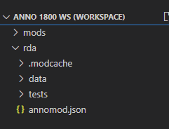
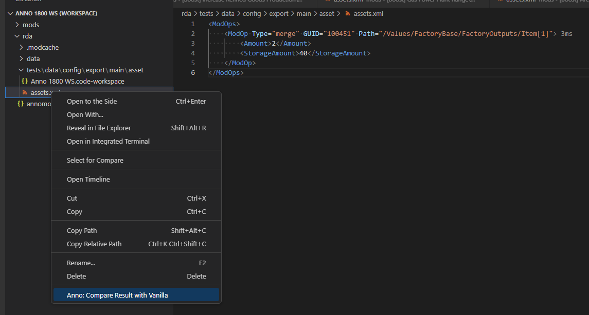
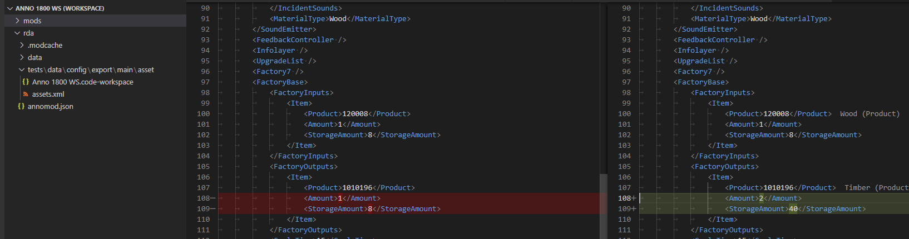
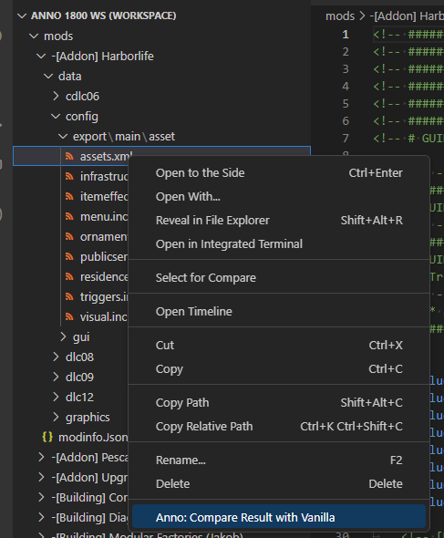

# Modding Tools for Anno

This project is not affiliated in any way with Ubisoft.

Anno 1800 is a trademark of Ubisoft Entertainment in the US and/or other countries. Anno is a trademark of Ubisoft GmbH in the US and/or other countries.

## Overview

- `Compare`: Apply mod and compare unpatched vs patched
- `GUID decorations`: See names of GUIDs directly where they are mentioned.
- [GUID conversion](#guid-conversion), [auto completion](#auto-completion)
- [Outline](#assets-outline): Anno-specific table of contents navigation for files
- [Syntax check](#syntax-check) for `assets.xml`, `.cfg`, `.ifo`, `.cf7`
- `Live Analysis`: See modloader errors embedded into your `assets.xml`.
- [Import from Blender or glTF](#import-from-blender-or-gltf) to `.cfg`, `.ifo` and `.cf7`
- [Reskin existing models](#quickly-reskin-existing-models) without touching `.cfg`, ...
- [Batch create](#build-anno-mod) DDS (with LODs), RDM (with LODs and animation) using `F1` > `Build Anno Mod` and `annomod.json` description.
- Various right-click utilities to convert between Anno and editable formats (glTF, PNG, ...)

## Setup

### 1. Extract assets.xml

For some features like auto completion and compare you need to extract `assets.xml` from the game.

- Get [RDAExplorer](https://github.com/lysannschlegel/RDAExplorer)
- Open the `.rda` file with the highest number from your Anno 1800 installation under `/Anno 1800/data/`.
- Extract the `data/config/export/main/asset/assets.xml` into a folder with the same structure, e.g. `c:\anno\rda\data\config\export\main\asset\assets.xml`.

### 2. Install XML plugin

Additionally, auto completion and other XML features work only in combination with a plugin that supports XSD validation.

- Install [XML Language Support by Red Hat](https://marketplace.visualstudio.com/items?itemName=redhat.vscode-xml)

### 3. Check configuration

Go into `File` > `Preferences` > `Settings...` and search for `anno` and configure the following:

- `Anno: Rda Folder`: Path with RDA data extracted (mostly `assets.xml` is used).
- `Anno: Mods Folder`: Path to your `Anno 1800/mods/` folder to deploy and find dependencies.

If you have the Red Hat XML plugin installed, search for `xml file associations` and add the following pattern:

```json
"xml.fileAssociations": [
  {
      "pattern": "assets*.xml",
      "systemId": "https://raw.githubusercontent.com/anno-mods/vscode-anno-modding-tools/main/generated/assets.xsd"
  }
]
```

### 4. How to open files

Most features only activate if you open folders, via `File` > `Open Folder...`.
Best open the mod folder or even the complete `mods/` folder.

The plugin has difficulties understanding the mod structure if you simply open individual files.

### 5. Example resulting workspace

After configuration you might have a workspace that looks something like this



### 5. Further Docs

- [Modding Guide](https://github.com/anno-mods/modding-guide#readme) (separate page)
- [glTF Tools](https://marketplace.visualstudio.com/items?itemName=cesium.gltf-vscode) VSCode Plugin

## Features

### Assets Outline


The assets.xml outline shows `ModOp`s, `Assets` and where possible names instead of GUIDs.

You have the ability to group by writing `<!-- # your text -->` comments in your code.

### GUID Conversion


You get a list of possible GUID matches to replace to.
The list is shown automatically in XML tags that expect a GUID, or after typing `GUID="` in ModOps. 

Otherwise, trigger the list manually with `Ctrl` + `Space`.

Not all GUIDs can be converted automatically due to performance. Most notable exclusions are `Test` and `Audio`.

### Auto Completion


Check [Setup](#setup) to activate this feature.

Now your code gets validated and you can press `Ctrl` + `Space` anywhere in the document and get a list of possible tags, enums or GUIDs.

### Syntax Check

The plugin will scan you asset files for common problems like the use of outdated pools (e.g. `190611`).
The file must match the naming scheme `assets*.xml` to be considered.

### Testing Snippets or Mods

You can run single snippets or test your entire mods merge results by rightclicking on the asset.xml and selecting 'Anno: Compare Results with Vanilla'

Example of a 'test' folder being added that contains  the full path structure of the assets.xml file you want to test snippets.


Which would show the following result



You can also test-merge your entire mod straight from the mod folder




### Import from Blender or glTF

Steps:

1. Follow naming conventions below
2. Export to glTF
3. Right-click on target `.cfg` and select `Import from glTF`.

Import an glTF file from one of the below examples into Blender to see how a project should look like:

- [New Town Hall](https://github.com/jakobharder/anno-1800-jakobs-mods/tree/main/new-town-hall-buildings) (multiple models in one .cfg)
- [Small Gas Power Plant](https://github.com/jakobharder/anno-1800-jakobs-mods/tree/main/small-gas-power-plant) (with animations)

⚠ Make sure to not edit the mesh of the objects, but the object position, scale and rotation only.

CFG file imports:

- `PROP`s with prefix `prop_` *(e.g. boxes, barrels)*
  - Position, Rotation, Scale
  - mesh name as `FileName` if it ends with `.prp`.
    Don't worry about Blender-style `.001`, `.002`, ... endings. They will be ignored.
  - Will be added if they don't exist.
- `PARTICLE`s with prefix `particle_` *(e.g. smoke)*
  - Position, Rotation, Scale
- `FILE`s with prefix `file_` *(included external cfg files)*
  - Position, Rotation, Scale
  - mesh name as `FileName` if it ends with `.cfg`.
  - Will be added if they don't exist.
- `DECAL` with name `ground` *(ground texture)*
  - Extents is calculated from all vertices of that object (e.g. plane).
    This modifies the ground texture. The building tile size is `<BuildBlocker>` in the IFO file.

Entries not existing in the model will be marked as `_removed` and not removed automatically.

CF7 file imports:

- `<Dummies><i>`: people, FireDummy, feedback_door, ...
  - Imported from multiple objects with prefix `fc_`.
  - `Position` and `Orientation` are taken from the object.
    `RotationY` is calculated from the orientation.
  - `<Name>` of the entry will be matched against what comes after `fc_`.
    E.g. `fc_Dummy0` will be matched against `<Name>Dummy0</Name>`.
  - Entries not existing in the model will not be removed.

IFO file imports:

- `<IntersectBox>`: clickable 3D area (aka hitbox) of the building
  - Imported from multiple mesh object (e.g. cube) with prefix `hitbox`
  - `Position`, `Rotation` and `Extents` are calculated from the boundaries of the objects.
    1 box per object.
- `<Dummy>`: transporter spawn, fire locations, ...
  - Imported from multiple objects with prefix `dummy_`.
  - `Position`, `Rotation` and `Extents` are taken from the object.
  - `<Name>` of the entry will be matched against what comes after `dummy_`.
    E.g. `dummy_transporter_spawn` will be matched against `<Name>transporter_spawn</Name>`.
  - Entries not existing in the model will not be removed.
- `<FeedbackBlocker>`: area people can walk through
  - Imported from multiple mesh objects (e.g. plane) with prefix `FeedbackBlocker`
  - `Position`s are taken from mesh vertices.
    Rounded to .25
- `<BuildBlocker>`: tile size of the building
  - Imported from one mesh object (e.g. plane) with name `ground`
  - `Position`s are taken from mesh vertices.
    Rounded to .5
- `<UnevenBlocker>`: area to always keep above ground
  - Imported from one mesh object (e.g. plane) with name `UnevenBlocker`
  - `Position`s are taken from mesh vertices.
    Rounded **up** in .25 steps

### Quickly Reskin Existing Models

Write a yaml file like below and name it `.cfg.yaml`.
IFO, FC/CF7 and CFG files will be generated accordingly.
Files are copied if they have the same name as the source.
Modifications are currently only supported in IFO and CFG files.

If you have `townhall.cfg`, `townhall.cf7` and `townhall.ifo`, then a `townhall_1.cfg.yaml` leads to generated `townhall_1.cfg`, `townhall_1.fc` and `townhall_1.ifo`. 

Examples: [New Town Hall](https://github.com/jakobharder/anno-1800-jakobs-mods/tree/main/new-town-hall-buildings)

```yaml
variant: 
  source: townhall.cfg
  modifications:
    - xpath: //Config/Models/Config/Materials/Config[Name="building"]
      cModelDiffTex: data/jakob/buildings/townhall/maps/townhall_bluish_diff.psd
    - xpath: //Config/Models/Config[Name="top"]
      FileName: data/jakob/buildings/townhall/rdm/townhall_2_lod0.rdm
    # disable smoke
    - xpath-remove: //Config/Particles/Config[Name="particle_smoke1"]
    # move flag 1
    - xpath: //Config/Files/Config[Name="file_flag1"]/Transformer/Config
      Position.y: 6.97816
  ifo:
    # adjust hitbox to new height
    - xpath: //Info/IntersectBox[Name="Hitbox2"]
      Position:
        yf: 4.34346
```

### Build Anno Mod

Automatically copy and convert mod files.

Press `F1` or right-click on `annomod.json` files to run `Build Anno Mod`.

Manual: [How to use annomod.json](./doc/annomod.md)

Examples: [Sources on GitHub](https://github.com/jakobharder/anno-1800-jakobs-mods/), [Compiled Mods](https://github.com/jakobharder/anno-1800-jakobs-mods/releases)

---

## Credits

A big thanks goes to the external projects I'm using for this extension:

- AnnoFCConverter - https://github.com/taubenangriff/AnnoFCConverter/
- rdm4 - https://github.com/lukts30/rdm4
- FileDBReader - https://github.com/anno-mods/FileDBReader
- texconv - https://github.com/microsoft/DirectXTex
- gltf-import-export - https://github.com/najadojo/gltf-import-export
- xmltest - https://github.com/xforce/anno1800-mod-loader

## Release Notes / Known Issues

See changes and known issues in [CHANGELOG](./CHANGELOG.md)