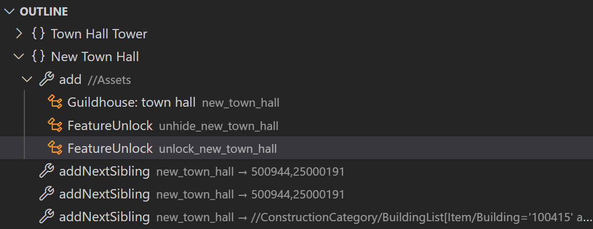
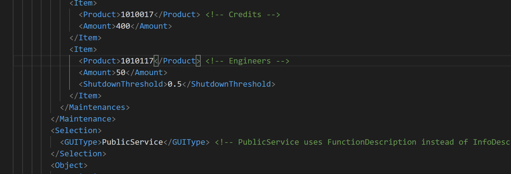
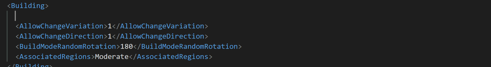

# Modding Tools for Anno

This project is not affiliated in any way with Ubisoft.

Anno 1800 is a trademark of Ubisoft Entertainment in the US and/or other countries. Anno is a trademark of Ubisoft GmbH in the US and/or other countries.

## Overview

- [Outline](#assets-outline), [GUID conversion](#guid-conversion), [auto completion](#auto-completion) and [syntax check](#syntax-check) for `assets.xml`, `.cfg`, `.ifo`, `.cf7`
- [Import from Blender or glTF](#import-from-blender-or-gltf) to `.cfg`, `.ifo` and `.cf7`
- [Reskin existing models](#quickly-reskin-existing-models) without touching `.cfg`, ...
- [Batch create](#build-anno-mod) DDS (with LODs), RDM (with LODs and animation) using `F1` > `Build Anno Mod` and `annomod.json` description.
- Various right-click utilities to convert between Anno and editable formats (glTF, PNG, ...)

### Recommended Plug-ins

- [XML Language Support by Red Hat](https://marketplace.visualstudio.com/items?itemName=redhat.vscode-xml)
- [glTF Tools](https://marketplace.visualstudio.com/items?itemName=cesium.gltf-vscode)

### Other Documentation

* [Working with models](https://github.com/anno-mods/vscode-anno-modding-tools/blob/main/doc/working-with-models.md) (separate page)
* [Working with particles](https://github.com/anno-mods/vscode-anno-modding-tools/blob/main/doc/working-with-particles.md) (separate page)

## Features

### Assets Outline



The assets.xml outline shows `ModOp`s, `Assets` and where possible names instead of GUIDs.

You have the ability to group by writing `<!-- # your text -->` comments in your code.

### GUID Conversion



You can type a name tags that expect GUID. You get a list of possible GUID matches to replace to.

Not all GUIDs can be converted automatically due to performance. Most notable exclusions are `Test` and `Audio`.

### Auto Completion



You need the Red Hat XML plugin installed. Then go to settings and search for `xml file associations` and add the following pattern:

```
"xml.fileAssociations": [
  {
      "pattern": "assets*.xml",
      "systemId": "https://raw.githubusercontent.com/anno-mods/vscode-anno-modding-tools/main/generated/assets.xsd"
  }
]
```
Now your code gets validated and you can press `Ctrl` + `Space` anywhere in the document and get a list of possible tags, enums or GUIDs.

### Syntax Check

The plugin will scan you asset files for common problems like the use of outdated pools (e.g. `190611`).
The file must match the naming scheme `assets*.xml` to be considered.

### Import from Blender or glTF


Steps:

1. Follow naming conventions below
2. Export to glTF
3. Right-click on target `.cfg` and select `Import from glTF`.

Import an glTF file from one of the below examples into Blender to see how a project should look like:

- [New Town Hall](https://github.com/jakobharder/anno-1800-jakobs-mods/tree/main/new-town-hall-buildings) (multiple models in one .cfg)
- [Small Gas Power Plant](https://github.com/jakobharder/anno-1800-jakobs-mods/tree/main/small-gas-power-plant) (with animations)

⚠ Make sure to not edit the mesh of the objects, but the object position, scale and rotation only.

CFG file imports:

- `PROP`s with prefix `prop_` *(e.g. boxes, barrels)*
  - Position, Rotation, Scale
  - mesh name as `FileName` if it ends with `.prp`.
    Don't worry about Blender-style `.001`, `.002`, ... endings. They will be ignored.
  - Will be added if they don't exist.
- `PARTICLE`s with prefix `particle_` *(e.g. smoke)*
  - Position, Rotation, Scale
- `FILE`s with prefix `file_` *(included external cfg files)*
  - Position, Rotation, Scale
  - mesh name as `FileName` if it ends with `.cfg`.
  - Will be added if they don't exist.
- `DECAL` with name `ground` *(ground texture)*
  - Extents is calculated from all vertices of that object (e.g. plane).
    This modifies the ground texture. The building tile size is `<BuildBlocker>` in the IFO file.

Entries not existing in the model will be marked as `_removed` and not removed automatically.

CF7 file imports:

- `<Dummies><i>`: people, FireDummy, feedback_door, ...
  - Imported from multiple objects with prefix `fc_`.
  - `Position` and `Orientation` are taken from the object.
    `RotationY` is calculated from the orientation.
  - `<Name>` of the entry will be matched against what comes after `fc_`.
    E.g. `fc_Dummy0` will be matched against `<Name>Dummy0</Name>`.
  - Entries not existing in the model will not be removed.

IFO file imports:

- `<IntersectBox>`: clickable 3D area (aka hitbox) of the building
  - Imported from multiple mesh object (e.g. cube) with prefix `hitbox`
  - `Position`, `Rotation` and `Extents` are calculated from the boundaries of the objects.
    1 box per object.
- `<Dummy>`: transporter spawn, fire locations, ...
  - Imported from multiple objects with prefix `dummy_`.
  - `Position`, `Rotation` and `Extents` are taken from the object.
  - `<Name>` of the entry will be matched against what comes after `dummy_`.
    E.g. `dummy_transporter_spawn` will be matched against `<Name>transporter_spawn</Name>`.
  - Entries not existing in the model will not be removed.
- `<FeedbackBlocker>`: area people can walk through
  - Imported from multiple mesh objects (e.g. plane) with prefix `FeedbackBlocker`
  - `Position`s are taken from mesh vertices.
    Rounded to .25
- `<BuildBlocker>`: tile size of the building
  - Imported from one mesh object (e.g. plane) with name `ground`
  - `Position`s are taken from mesh vertices.
    Rounded to .5
- `<UnevenBlocker>`: area to always keep above ground
  - Imported from one mesh object (e.g. plane) with name `UnevenBlocker`
  - `Position`s are taken from mesh vertices.
    Rounded **up** in .25 steps

### Quickly Reskin Existing Models

Write a yaml file like below and name it `.cfg.yaml`.
IFO, FC/CF7 and CFG files will be generated accordingly.
Files are copied if they have the same name as the source.
Modifications are currently only supported in IFO and CFG files.

If you have `townhall.cfg`, `townhall.cf7` and `townhall.ifo`, then a `townhall_1.cfg.yaml` leads to generated `townhall_1.cfg`, `townhall_1.fc` and `townhall_1.ifo`. 

Examples: [New Town Hall](https://github.com/jakobharder/anno-1800-jakobs-mods/tree/main/new-town-hall-buildings)

```yaml
variant: 
  source: townhall.cfg
  modifications:
    - xpath: //Config/Models/Config/Materials/Config[Name="building"]
      cModelDiffTex: data/jakob/buildings/townhall/maps/townhall_bluish_diff.psd
    - xpath: //Config/Models/Config[Name="top"]
      FileName: data/jakob/buildings/townhall/rdm/townhall_2_lod0.rdm
    # disable smoke
    - xpath-remove: //Config/Particles/Config[Name="particle_smoke1"]
    # move flag 1
    - xpath: //Config/Files/Config[Name="file_flag1"]/Transformer/Config
      Position.y: 6.97816
  ifo:
    # adjust hitbox to new height
    - xpath: //Info/IntersectBox[Name="Hitbox2"]
      Position:
        yf: 4.34346
```

### Build Anno Mod

Press `F1` or right-click on `annomod.json` files to run `Build Anno Mod`.

Example: [Sources on GitHub](https://github.com/jakobharder/anno-1800-jakobs-mods/), [Compiled Mods](https://github.com/jakobharder/anno-1800-jakobs-mods/releases)

#### `annomod.json` Format

```json
{
  "src": "src",
  "out": "${annoMods}/${modName}",  
  "converter": [
    {
      "action": "static",
      "pattern": "**/*.{cfg,ifo,prp,fc,rdm,dds}"
    },
    {
      "action": "cf7",
      "pattern": "**/*.cf7"
    },
    {
      "action": "texture",
      "pattern": "**/*_{diff,norm,height,metal}.png",
      "lods": 1
    },
    {
      "action": "gltf",
      "pattern": "**/*.{glb,gltf}"
    },
    {
      "action": "modinfo",
      "content_en": true
    }
  ],
  "modinfo": {}
} 
```

Converter actions:

- `static`: copies files according to [glob](https://github.com/isaacs/node-glob) `pattern`.
- `texture`: converts .pngs into .dds.
  - `lods`: number of LOD levels to generate, saved as `_0.dds` and so on. Set to 0 to disable LODs. Default is 3.
  - `changePath`: move texture to another folder, e.g. `maps`. Default is no change.
- `cf7`: converts .cf7 into .fc (using [AnnoFCConverter](https://github.com/taubenangriff/AnnoFCConverter/))
- `gltf`: converts .gltf to .rdm. (using [rdm4](https://github.com/lukts30/rdm4))
  - `lods`: number of LOD levels to pull out of .gltf files. Meshes must end with `_lod0` and so on to be considered. Set to 0 to disable LODs. Default is 4.
  - `changePath`: move model to another folder, e.g. `rdm`. Default is no change.
  - `animPath`: move anim to another folder, e.g. `anim`. Default is no change.
- `modinfo`: generate `modinfo.json`.
  - `content_en`: generate `content_en.txt` file with same content as `modinfo.Description.English`.
- `rdpxml`: convert .rdp.xml into .rdp. [More on a separate page](https://github.com/anno-mods/vscode-anno-modding-tools/blob/main/doc/working-with-particles.md)
- `cfgyaml`: generate CFG, IFO and FC files. [More in a separate chapter](#create-variants-from-templates).

Out folder variables:

- Use `${modName}` to get `[Category] Name` created from `modinfo.Category.English` and `modinfo.ModName.English`. Works only with `out`.
- Use `${annoMods}` to get your local Anno `mods/` directory set in the Extension configuration. Works only with `out`.

Modinfo:

- Basically Anno Mod Manager [modinfo.json](https://github.com/anno-mods/Modinfo) content.
- `modinfo.Description` differs from what the Anno Mod Manager uses. Instead of text use a relative path to a Markdown file. Images will be excluded from the Markdown.

---

## Extension Settings

* `anno.modsFolder`: (optional) path to your `mods/` folder. Available as `${annoMods}` in `annomod.json`. Not required if you don't use the variable.
* `anno.rdaFolder`: (optional) path with RDA data extracted. Available as `${annoRda}` in `*.cfg.yaml` files. You only need the data extracted your mods need. The extension itself does not use this.
* `anno.outlineFolderDepth`: folder depth of props, materials and alike shown .cfg outline.

## Requirements

Some features like .fc conversion rely on external applications that run only on Windows.
Native functions like outlines, highlighting work with Linux/WSL as well though.

## Credits

A big thanks goes to the external projects I'm using for this extension:

- AnnoFCConverter - https://github.com/taubenangriff/AnnoFCConverter/
- rdm4 - https://github.com/lukts30/rdm4
- FileDBReader - https://github.com/anno-mods/FileDBReader
- texconv - https://github.com/microsoft/DirectXTex
- gltf-import-export - https://github.com/najadojo/gltf-import-export
- xmltest - https://github.com/xforce/anno1800-mod-loader

## Release Notes / Known Issues

See changes and known issues in [CHANGELOG](./CHANGELOG.md)