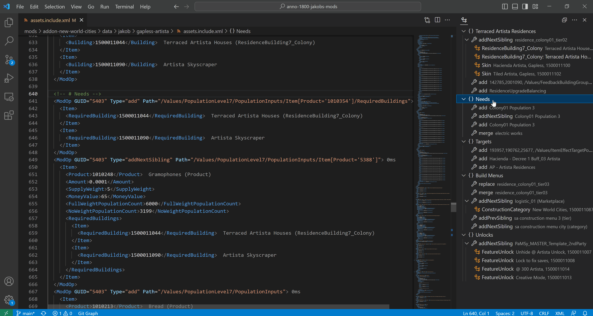
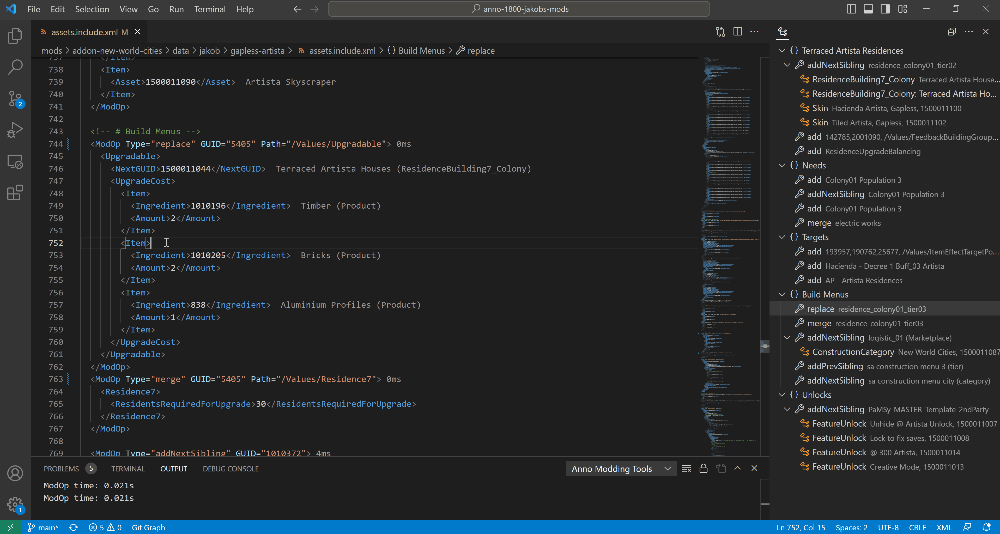

# Modding Tools for Anno

Tools to create mods for Anno 1800 and Anno 117: Pax Romana.

## Feature Overview

See also [Feature Details](#feature-details) page, and the [CHANGELOG](./CHANGELOG.md) for recent changes.

### [Navigation and IntelliSense](#navigation)

  - Navigate with Anno-specific outlines: _Secondary Side Bar or `Ctrl+Shift+O`_
  - Inline asset name display next to GUIDs
  - Jump to asset (vanilla or modded): _right click on GUID > `Go to Definition`_
  - Asset Lookup (vanilla or modded): _`Ctrl+T`_
  - [GUID conversion](#guid-conversion) (only Anno 1800)
  - [XML auto completion](#auto-completion) (only Anno 1800)

### [Syntax and Error Checking](#annotations-live-analysis-syntax)

  - Modinfo.json syntax analysis
  - XML syntax analysis using Red Hat XML (only Anno 1800)
  - Live patch error and performance analysis
  - Missing filename check

### Utilities

  - [Show Diff](#command-compare): Compare original and patched result. _Right click in text editor or explorer > `Show Diff`_
  - [Deploy Mod](./doc/annomod.md): Copy to `mods/` folder and generate DDS (with LODs) and other files automatically. _Status Bar > click on `Anno 1800/117: ModID` button_

### [Model and Texture Utilities](./doc/model-texture-utils.md)

  - Convert to and from Anno specific file formats (DDS <> PNG, RDM <> glTF, ...). _Right click in explorer > `Anno: Convert to ...`_
  - Import from Blender glTF to `.cfg`, `.ifo` and `.cf7`. _Right click in explorer > `Anno: Import from ...`_
  - Reskin existing models without touching `.cfg`, ... (only Anno 1800)

## Quick Setup

See also the [Setup](./doc/setup.md) page for detailed documentation.

### How to open files

Most features only activate if you a open folder (e.g. `File` > `Open Folder...`) that includes one or more full mods (detected by `modinfo.json`).

You can also work with parent folders, or your complete `mods/` folder.

### Check configuration

Go into `File` > `Preferences` > `Settings` and search for `anno` to configure the following:

- `Anno.*: Game Path`: Path to your Anno installation.

  E.g. *'C:\\Program Files (x86)\\Ubisoft\\Ubisoft Game Launcher\\games\\Anno 117'*.

## Feature Details

### Annotations, Live Analysis, Syntax

#### Outline

The outline shows `ModOp`s, `Assets` and where possible names instead of GUIDs.

Top-level sections can be created with `<!-- # your text -->` comments.
The `Group` keyword can also be used for further grouping.
Write normal XML comments above groups to name them.

#### GUID Annotation

Displays name and template name of GUIDs.

This feature will also consider Mod GUIDs, if they are either:
- part of your own mod
- part of a dependency mentioned in `modinfo.json` and installed into the game's `mods/` folder

#### Live Analysis

The live analysis applies your mod on save to the game and provides error and performance information.

#### Syntax Check

The plugin will scan you asset files for common problems like the use of outdated pools (e.g. `190611`).
The file must match the naming scheme `assets*.xml` to be considered.

### Navigation

#### Navigate via Outline

You can click on any outline entry to directly jump to that section in the code.

#### Go to Asset

Right click on any GUID and select `Go to Definition` or press `F12` to jump to the related Mod or vanilla asset.

You can press `Ctrl+T` and type the asset name to jump to assets as well.

### Command `Compare`

You can check th results of one or more `ModOp`s by selecting them and then right click > `Anno: Compare Results with Vanilla`.

Alternatively, you can compare full files and mods by right clicking on `assets.xml`, `templates.xml` and `*.include.xml`.

### GUID Conversion

You get a list of possible GUID matches to replace to.
The list is shown automatically in XML tags that expect a GUID, or after typing `GUID="` in ModOps. 

Otherwise, trigger the list manually with `Ctrl` + `Space`.

Not all GUIDs can be converted automatically due to performance. Most notable exclusions are `Test` and `Audio`.

### Auto Completion

Check [Setup](#setup) to activate this feature.

Now your code gets validated and you can press `Ctrl` + `Space` anywhere in the document and get a list of possible tags, enums or GUIDs.

Note: If you want to force updates for auto-completion delete `C:\Users\<user>\.lemminx` and re-open VSCode.

---

## Credits

This is a personal project and not an official product of Ubisoft.
Anno is a trademark of Ubisoft Entertainment in the US and/or other countries.

A big thanks goes to the external projects I'm using for this extension:

- AnnoFCConverter - https://github.com/taubenangriff/AnnoFCConverter/
- rdm4 - https://github.com/lukts30/rdm4
- FileDBReader - https://github.com/anno-mods/FileDBReader
- texconv - https://github.com/microsoft/DirectXTex
- gltf-import-export - https://github.com/najadojo/gltf-import-export
- xmltest - https://github.com/xforce/anno1800-mod-loader
