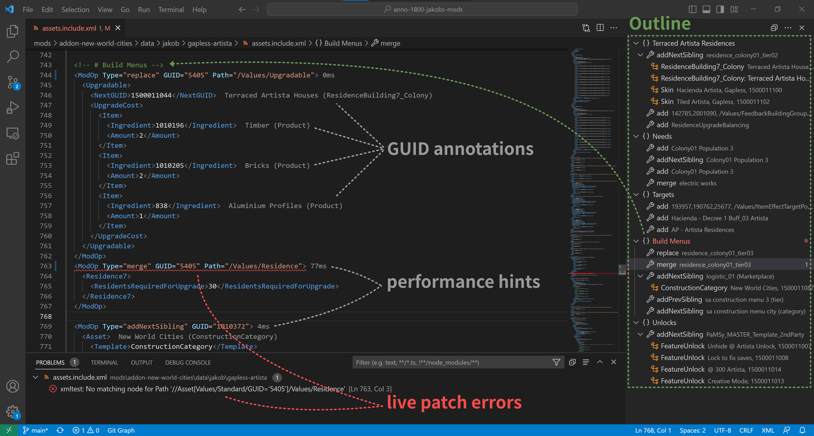

# Syntax and Error Checking

#### Live Analysis

The live analysis applies your mod on save to the game and provides error and performance information.

#### Syntax Check

The plugin will scan you asset files for common problems like the use of outdated pools (e.g. `190611`).
The file must match the naming scheme `assets*.xml` to be considered.