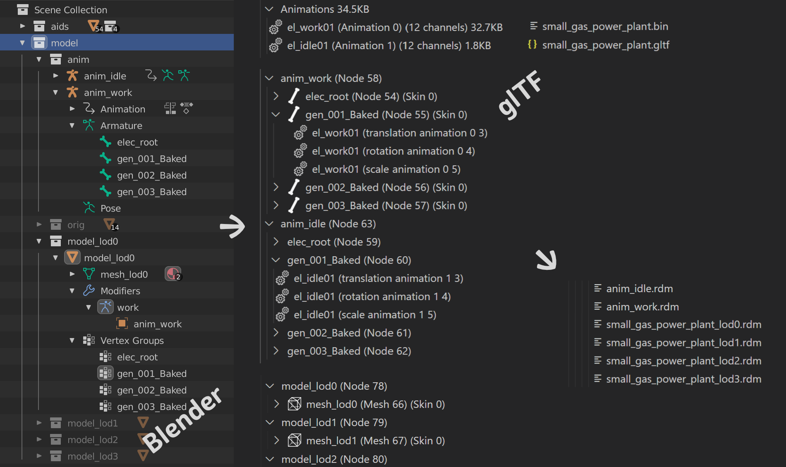

# Working with Models

This extension uses [rdm4](https://github.com/lukts30/rdm4) in the background to do the conversion from glTF to RDM.

Most of the conversion magic on top is based on naming conventions.

## Output

The extension generates the following output from a single glTF file:

- *&lt;model-file-name&gt;*_lod0.rdm .. *&lt;model-file-name&gt;*_lod9.rdm
  - Number of LODs depends on your `annomod.json` configuration and what the model contains.
  - *&lt;model-file-name&gt;*.rdm if LODs are disabled. 
- *&lt;anim&gt;*.rdm
  - *anim* is the name of bones node in glTF / Armature node in Blender.

## Model Conventions

If you have only a single mesh, or use separate files for your LODs, then you don't need to worry about anything.

If you want to use the LOD extraction, the model needs to follow a few conventions:

- For the LOD extraction, meshes (or their parent node) named `*_lod0` to max `*_lod9` will be used.
- If `*_lod0` is not available, the first mesh will be used instead for LOD 0.
- Further LODs without matching mesh name will be skipped.

- ⚠ Enable export of **tangents** in Blender. They are disabled by default.

## Models with Animation

- joints exported
- Named `node`s with bones as children
  - Armature in Blender
  - the name will be used for output file name
- `animation`s where joints point to the bones
  - Armature modifier in Blender, matching names in bones and vertex groups.
- 1 `skin`
  - Even if you have multiple animations, only one should be actively linked to the model. The others just have to follow the same bone names.

## How it works

The following are the steps the `gltf` converter does internally.
They might be useful if you want to manually convert models or debug problems.

1. The converter replaces all image URIs with a fake.png to avoid missing texture errors. They are not exported anyway.

2. It creates for every animation one temporary glTF file where other animations are removed.
  It also renames unused bones so that `rdm4` can match the right bones with the animation by name.
  `rdm4` options are `--gltf-mesh-index`, `--animation` and `--skeleton`.

3. For LOD 0, it uses the model output from the first animation creation.

4. It creates further LODs with options `--gltf-mesh-index` and `--skeleton`.

- All models with animations are created with `P4h_N4b_G4b_B4b_T2h_I4b`. Models without with `P4h_N4b_G4b_B4b_T2h`.

Pitfalls:

- LOD 0 and other LODs must have same vertex format e.g. `P4h_N4b_G4b_B4b_T2h_I4b`
- `NumBonesPerVertex` in the .cfg file must be 1 in case of animations and `P4h_N4b_G4b_B4b_T2h_I4b`.
- LOD 0 must be created with `--animation` or otherwise it won't show up in the game, the other LODs can be created without.

## Example Screenshot

